# Assignment 2

**Author:** Yu-Ming (Jonathan) Wang

---

## 🗁 Repository Structure

```
Cloud-Computing-Assignment-2/
│
├── Dockerfile                         # Flask app image definition
├── docker-compose.yml                 # Optional local test
├── flask-deployment.yaml              # Minikube: Flask Deployment & Service
├── mongo-deployment.yaml              # Minikube: MongoDB Deployment & Service
├── flask-deployment_eks.yaml          # EKS: Flask Deployment & Service
├── mongo-deployment_eks.yaml          # EKS: MongoDB Deployment & Service
├── screenshots/                       # All screenshots go here
├── alertmanager-values.yaml           # Extra Point
├── pod-monitoring-alerts.yaml         # Extra Point
└── README.MD
```

---

## 🧱 1. Docker Image for Flask Application

### Dockerfile

define flask-todo image

---

## 🧩 2. Local Test via Docker Compose and push to Docker Hub

### docker-compose.yml

```bash
docker-compose up
```

```bash
docker start flask
```

```bash
docker logs -f flask-todo
```
Open the service in a browser

✅ **Screenshot:** 
✅ **Screenshot:** 

---

## ☸️ 3. Deploy on Minikube

### Start Cluster

```bash
minikube start
```

### Deploy MongoDB + Flask

```bash
kubectl apply -f mongo-deployment.yaml
kubectl apply -f flask-deployment.yaml
```

### Verify

```bash
kubectl get pods
kubectl get svc
```

### Access the App

```bash
minikube service flask-to-service
```

### Stop MiniKube service

```bash
minikube stop
```

✅ **Screenshots:**

* 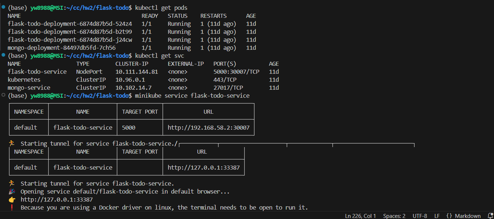
* 

---

## ☁️ 4. Deploy on AWS EKS

### Create Cluster (via AWS Console)

1. Navigate to EKS → **Create Cluster**
2. Choose Kubernetes version 1.33
3. Add Node Group (t3.medium × 2)
4. Wait until status = **Active**

✅ **Screenshot:** 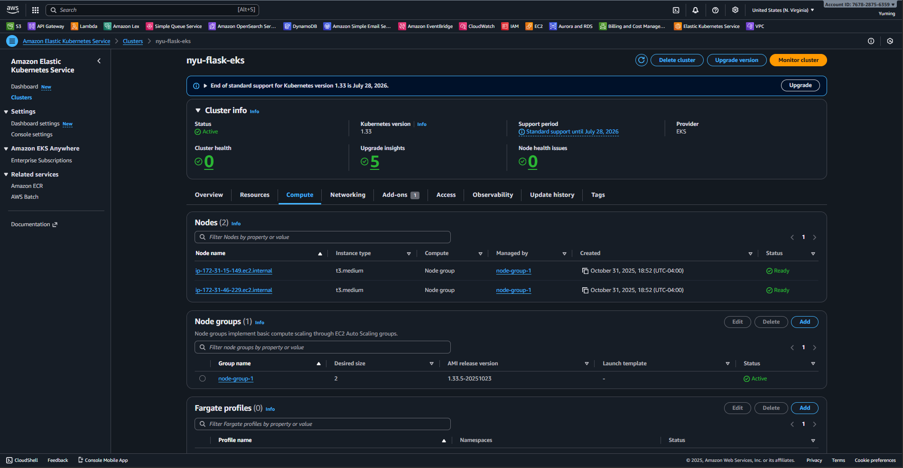

### Create new config

```bash
aws eks --region us-east-1 update-kubeconfig --name <cluster_name>
kubectl get nodes
```
✅ **Screenshot:** 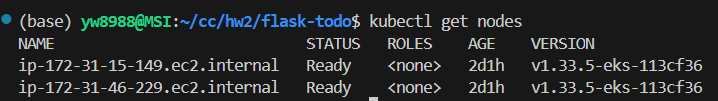

### Switch kubectl to EKS cluster config

```bash
kubectl config get-contexts 
kubectl config use-context arn:aws:eks:us-east-1:767828756359:cluster/nyu-flask-eks
```

### Deploy App

```bash
kubectl apply -f mongo-deployment_eks.yaml
kubectl apply -f flask-deployment_eks.yaml
```

### Check Status

```bash
kubectl get pods
kubectl get svc
```

### Open service
```bash
http://aac29ca36dc684ab3b215927d1e76622-1360838796.us-east-1.elb.amazonaws.com:5000
```

✅ **Screenshots:**

* 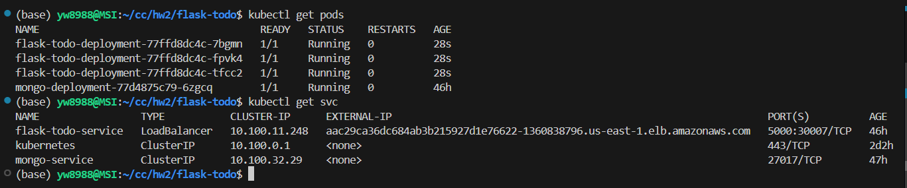
* 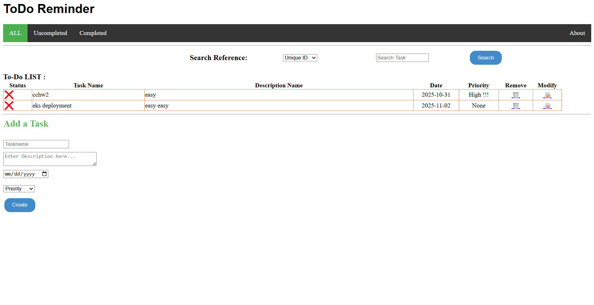

---

## 🔄 5. Deployments and ReplicaSets

```bash
# Check deployment
kubectl get deployment flask-todo-deployment
```

```bash
# Check ReplicaSets
kubectl get rs
```

✅ **Screenshot:** 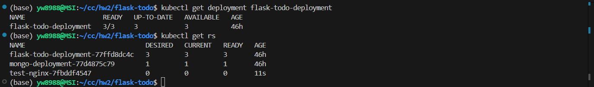

### Pod Recovery Demo

```bash
kubectl delete pod <flask_pod_name>
kubectl get pods
```

✅ **Screenshot:** 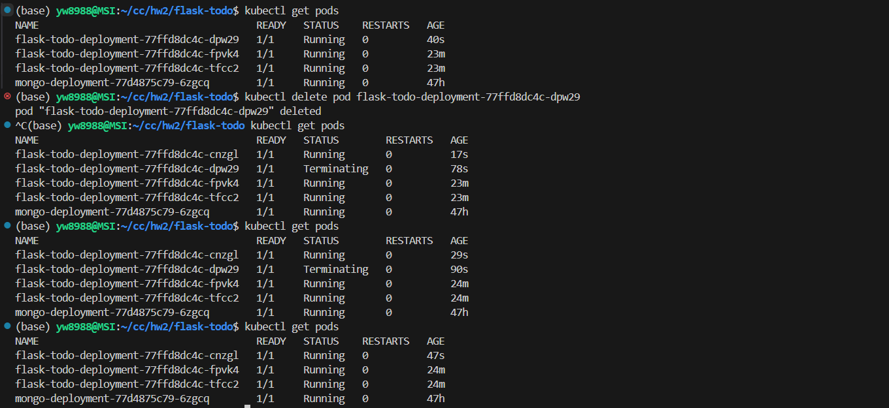

### Scale Demo
```bash
kubectl scale deployment flask-todo-deployment --replicas=5
kubectl get pods
```

✅ **Screenshot:** 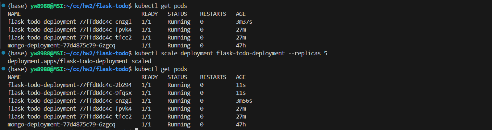

---

## 🔄 6. Rolling Update

### Push a new version to Docker Hub and give a tag 
```bash
docker tag yw8988/flask-todo:latest yw8988/flask-todo:v3
```

✅ **Screenshot:** 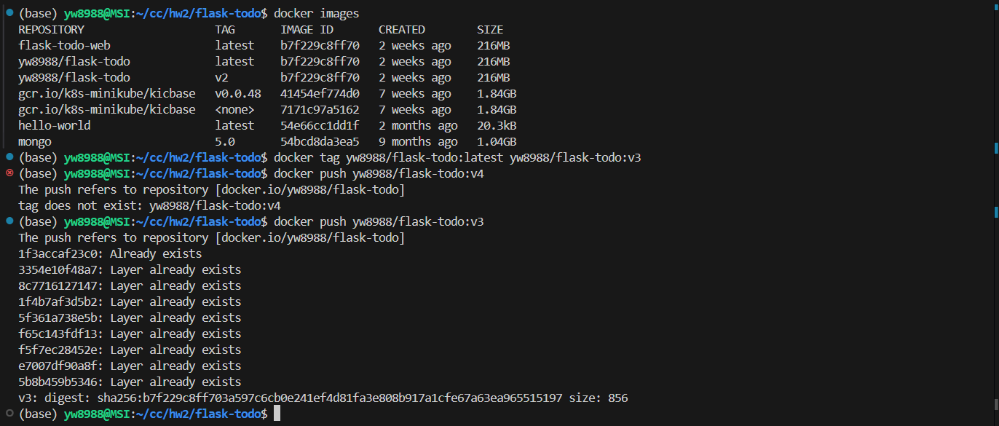
✅ **Screenshot:** 

```bash
# Update image version
kubectl set image deployment flask-todo-deployment flask-todo=yw8988/flask-todo:v3
```

```bash
# Check rollout progress
kubectl rollout status deployment/flask-deployment
kubectl get pods
kubectl get deployment flask-todo-deployment
kubectl describe deployment flask-todo-deployment
```

✅ **Screenshot:** 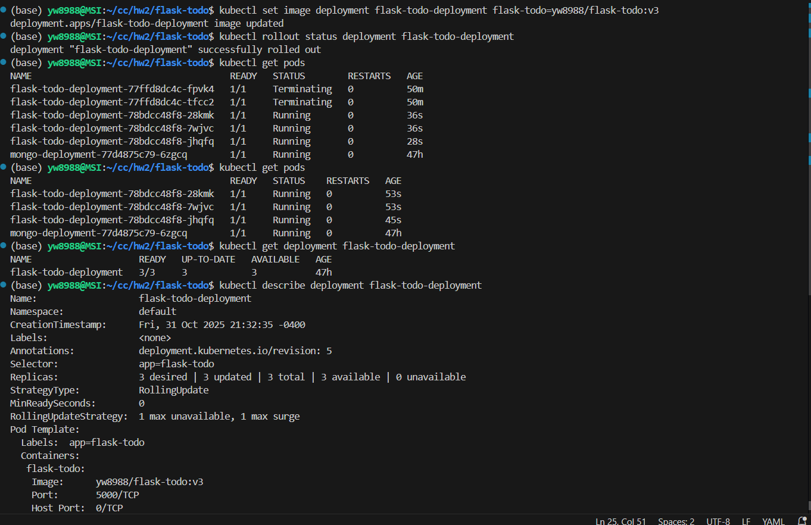

---

## ❤️‍🔥 7. Health Probes and Monitoring

```yaml
livenessProbe:
  httpGet:
    path: /
    port: 5000
  initialDelaySeconds: 10
  periodSeconds: 15

readinessProbe:
  httpGet:
    path: /
    port: 5000
  initialDelaySeconds: 5
  periodSeconds: 10
```


To test the liveness probe, the /list endpoint was temporarily changed to an invalid path /brokenpath using kubectl patch.
Kubernetes detected repeated 404 responses from the probe, marked the pod as unhealthy, and automatically restarted it.
The restart count increased, confirming that the liveness probe and self-healing mechanism work correctly.


### Intention break app
```bash
kubectl patch deployment flask-todo-deployment \
  --type='json' \
  -p='[
    {"op": "replace", "path": "/spec/template/spec/containers/0/livenessProbe/httpGet/path", "value": "/list"}
  ]'

```

✅ **Screenshot:** 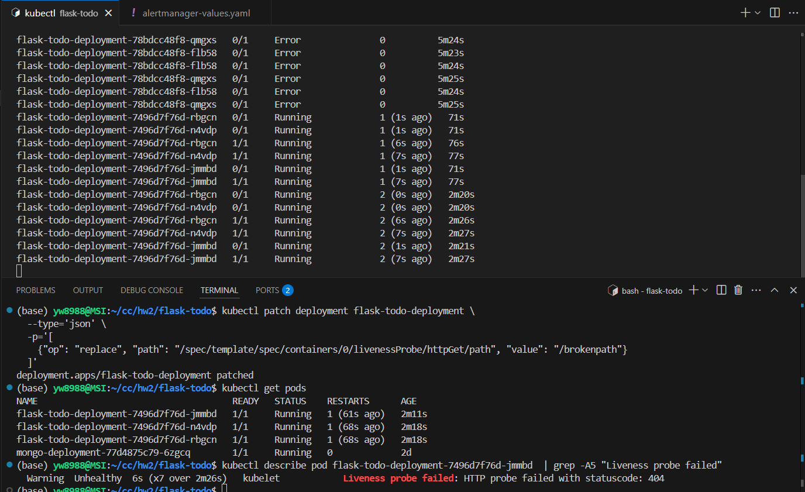


### Change back 
```bash
kubectl patch deployment flask-todo-deployment \
  --type='json' \
  -p='[
    {"op": "replace", "path": "/spec/template/spec/containers/0/livenessProbe/httpGet/path", "value": "/list"}
  ]'
```


To check the readiness probe, we follow the same procedure. The readiness probe was intentionally modified from /list to /brokenpath.
Kubernetes reported repeated readiness probe failures (HTTP 404), marking the pod as NotReady (0/1).
The pod remained running (no restarts) but was temporarily removed from the service endpoints.
After restoring the probe path, the pod returned to 1/1 Ready and resumed serving traffic.

### Intention break app
```bash
kubectl patch deployment flask-todo-deployment \
  --type='json' \
  -p='[
    {"op": "replace", "path": "/spec/template/spec/containers/0/readinessProbe/httpGet/path", "value": "/brokenpath"}
  ]'
```

✅ **Screenshot:** 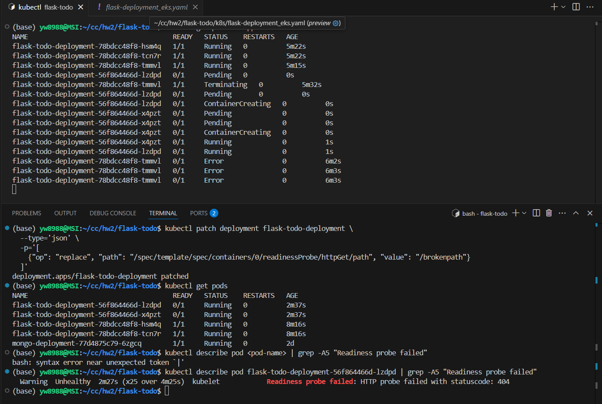

### Change back 
```bash
kubectl patch deployment flask-todo-deployment \
  --type='json' \
  -p='[
    {"op": "replace", "path": "/spec/template/spec/containers/0/readinessProbe/httpGet/path", "value": "/list"}
  ]'

```

---

## ⚡ 8. Prometheus + Slack Alerting (Extra Credit 30 pts)

Deploy `alertmanager-values.yaml` and `pod-monitoring-alerts.yaml`
Prometheus and Alertmanager are deployed in the monitoring namespace via Helm

```bash
helm repo add prometheus-community https://prometheus-community.github.io/helm-charts
helm install prometheus prometheus-community/kube-prometheus-stack -n monitoring
```

✅ **Screenshot:** 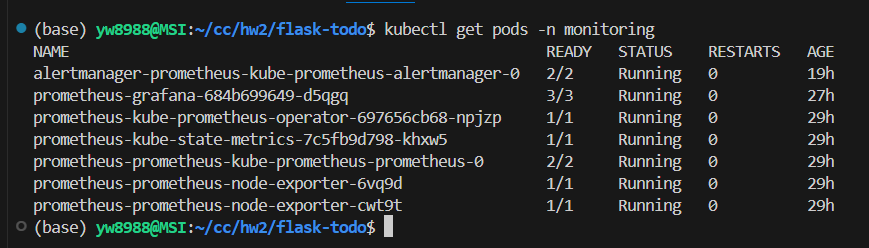

We test by rescaling the replica to zero and get alerts from Slack

✅ **Screenshot:** 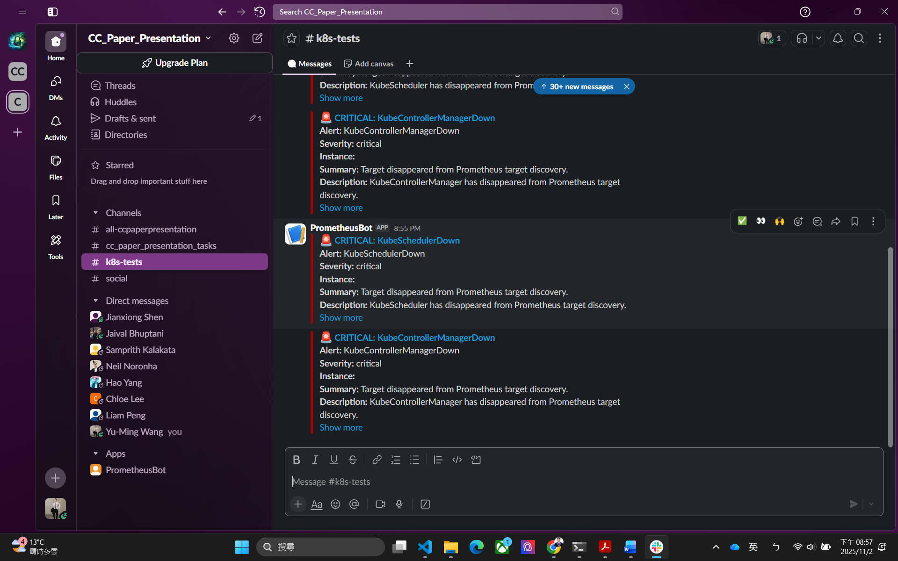


