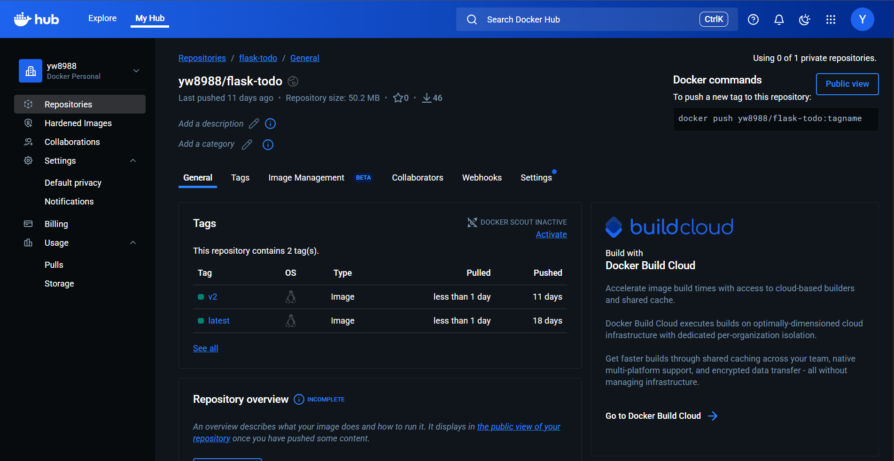

# ☁️ Cloud Computing & Big Data Systems – Assignment 2

**Author:** Yu-Ming (Jonathan) Wang

---

## 🗁 Repository Structure

```
Cloud-Computing-Assignment-2/
│
├── Dockerfile                         # Flask app image definition
├── docker-compose.yml                 # Optional local test
├── flask-deployment.yaml              # Minikube: Flask Deployment & Service
├── mongo-deployment.yaml              # Minikube: MongoDB Deployment & Service
├── flask-deployment_eks.yaml          # EKS: Flask Deployment & Service
├── mongo-deployment_eks.yaml          # EKS: MongoDB Deployment & Service
├── screenshots/                       # All screenshots go here
│   ├── docker_push.png
│   ├── minikube_dashboard.png
│   ├── minikube_app_running.png
│   ├── eks_cluster_console.png
│   ├── eks_app_running.png
│   ├── rolling_update.png
│   └── health_probe_status.png
└── README.md
```

---

## 🧱 1. Docker Image for Flask Application

### Dockerfile

define flask-todo image

---

## 🧩 2. Local Test via Docker Compose and push to Docker Hub

### docker-compose.yml

```bash
docker start flask
```

```bash
docker logs -f flask-todo
```
Open the service in a browser

✅ **Screenshot:** 
✅ **Screenshot:** 

---

## ☸️ 3. Deploy on Minikube

### Start Cluster + Add-ons

```bash
minikube start
minikube addons enable dashboard
minikube addons enable metrics-server
```

### Deploy MongoDB + Flask

```bash
kubectl apply -f mongo-deployment.yaml
kubectl apply -f flask-deployment.yaml
```

### Verify

```bash
kubectl get pods
kubectl get svc
```

### Access the App

```bash
minikube service flask-service
```

✅ **Screenshots:**

* 
* 
* 

### Pod Recovery Demo

```bash
kubectl delete pod <flask_pod_name>
kubectl get pods
```

✅ **Screenshot:** 

---

## ☁️ 4. Deploy on AWS EKS

### Create Cluster (via AWS Console)

1. Navigate to EKS → **Create Cluster**
2. Choose Kubernetes version 1.29
3. Add Node Group (t3.medium × 2)
4. Wait until status = **Active**

✅ **Screenshot:** 

### Configure kubectl

```bash
aws eks --region us-east-1 update-kubeconfig --name <cluster_name>
kubectl get nodes
```

### Deploy App

```bash
kubectl apply -f mongo-deployment_eks.yaml
kubectl apply -f flask-deployment_eks.yaml
```

### Check Status

```bash
kubectl get pods
kubectl get svc
```

✅ **Screenshots:**

* 
* 
* 

---

## 🔄 5. Rolling Update

```bash
# Update image version
kubectl set image deployment/flask-deployment flask=yw8988/flask-todo:v2

# Check rollout progress
kubectl rollout status deployment/flask-deployment
```

✅ **Screenshot:** 

---

## ❤️‍🔥 6. Health Probes and Monitoring

```yaml
livenessProbe:
  httpGet:
    path: /
    port: 5000
  initialDelaySeconds: 10
  periodSeconds: 15

readinessProbe:
  httpGet:
    path: /
    port: 5000
  initialDelaySeconds: 5
  periodSeconds: 10
```

Check:

```bash
kubectl describe pod <flask_pod_name>
```

✅ **Screenshot:** 

---

## 📈 7. ReplicaSet Scaling

```bash
kubectl scale deployment flask-deployment --replicas=3
kubectl get rs
```

✅ **Screenshot:** 

---

## ⚡ (Extra Credit 30 pts) Prometheus + Slack Alerting

Optional bonus section for alert integration tests.
Include: `prometheus-deployment.yaml`, `alertmanager-config.yaml`, and Slack alert screenshot.
